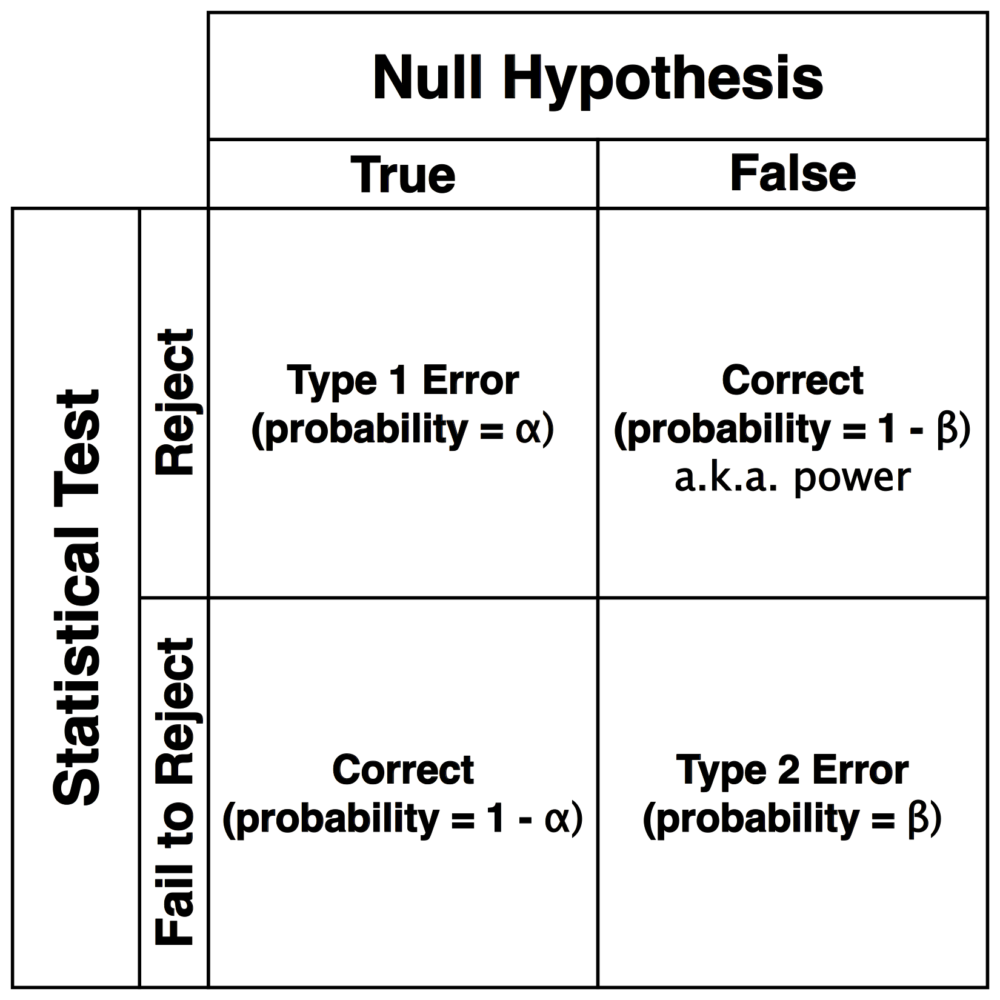
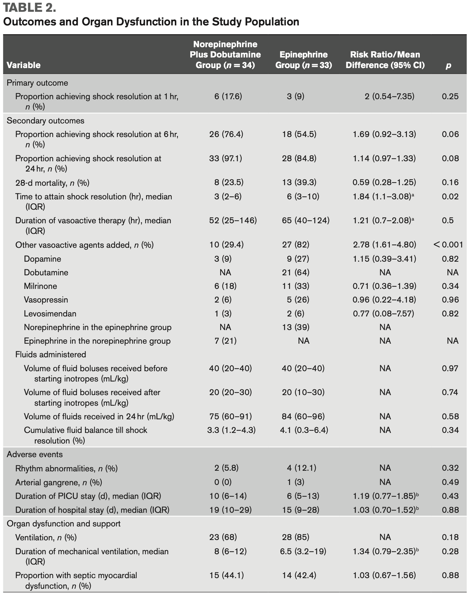

```{r setup, include=FALSE}
knitr::opts_chunk$set(echo = FALSE, warning = FALSE, message = FALSE)
library(ggplot2)
library(metafor)
library(dplyr)
library(tidyr)
library(xaringanthemer)

style_mono_accent(base_font_size = '16px')
```

class: middle

# Agenda

**Basic Statistics - times**
<br>
1. Some Terms - 3 minutes
<br><br>
2. Accuracy versus Precision - 5 minutes
<br><br>
3. Statistical inference - 5 minutes
<br><br>
5. Hypothesis testing - 20 minutes
<br><br>
6. Brief Probability - 17 minutes
<br><br>
7. Important Caveats - 5 minutes

---

class: middle, center

# Basic Statistical Terms

---

class: middle

# There are some important random terms

--

- **Generalizability**
  - How applicable is a finding from a particular sample to the population
--

- **P-value**
  - Probability of finding a value this extreme by random chance (given the assumption of a true null)
--

- **Confidence Interval**
  - Interval over which population (true?) value is expected to be found with a specified probability (e.g. 95%)
--

- **Efficacy**
  - Performance of treatment under ideal circumstances
--

- **Effectiveness**
  - Performance of treatment under real world circumstances

---

class: middle, center

# Accuracy and Precision

---

class: middle, center

# Reminder of Accuracy v. Precision


---

class: middle, left

# Accuracy v. Precision in words

1. Accuracy is how close an estimate is to the true value

2. Precision is how much variation exists in the estimate

---

class: middle, center

# Statistical Inference

---

class: middle

# Statistical distributions have invariant properties

.pull-left[
```{r, message=FALSE, warning=FALSE, echo=FALSE}
library(ggplot2)
norm <- rnorm(10000, sd = 1)
ggplot(data.frame(data = norm), aes(data)) + 
  geom_histogram(binwidth = 0.2) + 
  xlim(-10, 10) + 
  ylim(0, 950) +
  ggtitle("Normal Distribution") + 
  labs(x="", y="") +
  theme_bw() +
  annotate("text", x = -10, y = 950, label = "Mean = Median = Mode", size=5, hjust = 0) +
  annotate("text", x = -10, y = 900, label = "68.3% CI ~ Mean +- 1 SD", size=5, hjust = 0) +
  annotate("text", x = -10, y = 850, label = "95.5% CI ~ Mean +- 2 SD", size=5, hjust = 0) +
  annotate("text", x = -10, y = 800, label = "99.7% CI ~ Mean +- 3 SD", size=5, hjust = 0)
```
]

.pull-right[
```{r, message=FALSE, warning=FALSE, echo=FALSE}
library(ggplot2)
studentt <- rt(10000, df=2)
ggplot(data.frame(data = studentt), aes(data)) + 
  geom_histogram(binwidth = 0.2)  + 
  xlim(-10, 10) + 
  ylim(0, 950) +
  ggtitle("Student t Distribution") + 
  labs(x="", y="") +
  theme_bw() +
  annotate("text", x = -10, y = 950, label = "Mean = Median = Mode", size=5, hjust = 0) +
  annotate("text", x = -10, y = 900, label = "95% CI depends on degrees of freedom", size=5, hjust = 0)
```
]

---

class: middle

# Real distributions can have one or multiple peaks

.pull-left[
```{r, message=FALSE, warning=FALSE, echo=FALSE}
library(ggplot2)
norm <- rnorm(10000, mean = 5, sd = 1)
ggplot(data.frame(data = norm), aes(data)) + 
  geom_histogram(binwidth = 0.1) + 
  xlim(0, 10) + 
  ylim(0, 500) +
  ggtitle("Unimodal Distribution") + 
  theme_bw() +
  labs(x="", y="")
```
]

.pull-right[
```{r, message=FALSE, warning=FALSE, echo=FALSE}
library(ggplot2)
norm1 <- rnorm(5000, mean = 3, sd = 0.8)
norm2 <- rnorm(5000, mean = 6, sd = 0.8)
ggplot(data.frame(data = c(norm1, norm2)), aes(data)) + 
  geom_histogram(binwidth = 0.1) + 
  xlim(0, 10) + 
  ylim(0, 500) +
  ggtitle("Bimodal Distribution") + 
  theme_bw() +
  labs(x="", y="")
```
]

---

class: middle

# Skew describes the direction of the tail

.pull-left[
```{r, message=FALSE, warning=FALSE, echo=FALSE}
library(ggplot2)
Mode <- function(x) {
  ux <- unique(x)
  ux[which.max(tabulate(match(x, ux)))]
}
r.skew <- rchisq(100000, df = 5)
ggplot(data.frame(data = r.skew), aes(data)) +
  geom_histogram(binwidth = 0.4, fill = 'lightgray') + 
  geom_vline(xintercept = mean(r.skew), linetype = 'dotted', lwd = 1) +
  geom_vline(xintercept = median(r.skew), linetype = "dashed", lwd = 1) +
  geom_vline(xintercept = Mode(round(r.skew, digits = 2)), linetype = "solid", lwd = 1) +
  xlim(0, 30) + 
  ylim(0, 6500) +
  ggtitle("Right Skewed") + 
  labs(x="", y="") +
  annotate("text", x = 8, y = 6000, label = "Mean, Median, and Mode are not\nequal in skewed distributions.", size = 6, hjust = 0) +
  theme_bw() +
  annotate("text", x = 8, y = 4000, label = "Each of the lines represents a\nmeasure of central tendency.\nKnow their orientation in positive\nand negative skewed distributions.", size = 6, hjust = 0)
```
]

.pull-right[
```{r, message=FALSE, warning=FALSE, echo=FALSE}
library(ggplot2)
Mode <- function(x) {
  ux <- unique(x)
  ux[which.max(tabulate(match(x, ux)))]
}
l.skew <- 30 - rchisq(100000, df = 5)
ggplot(data.frame(data = l.skew), aes(data)) + 
  geom_histogram(binwidth = 0.4, fill = 'lightgray') + 
  geom_vline(xintercept = mean(l.skew), linetype = 'dotted', lwd = 1) +
  geom_vline(xintercept = median(l.skew), linetype = "dashed", lwd = 1) +
  geom_vline(xintercept = Mode(round(l.skew, digits = 2)), linetype = "solid", lwd = 1) +
  xlim(0, 30) + 
  ylim(0, 6500) +
  ggtitle("Left Skewed") + 
  theme_bw() +
  labs(x="", y="")
```
]

---

class: middle 

# Question
 
.pull-left[
Which of the following corresponds to the measures of central tendency on the graph from **left to right**? 

1. mean, median, mode
2. mode, mean, median
3. median, mode, mean
4. mode, median, mean
5. mean, mode, median
]

.pull-right[
```{r, message=FALSE, warning=FALSE, echo=FALSE}
library(ggplot2)
Mode <- function(x) {
  ux <- unique(x)
  ux[which.max(tabulate(match(x, ux)))]
}
r.skew <- rchisq(100000, df = 5)
ggplot(data.frame(data = r.skew), aes(data)) +
  geom_histogram(binwidth = 0.4, fill = 'lightgray') + 
  geom_vline(xintercept = mean(r.skew), linetype = 'dotted', lwd = 1) +
  geom_vline(xintercept = median(r.skew), linetype = "dashed", lwd = 1) +
  geom_vline(xintercept = Mode(round(r.skew, digits = 2)), linetype = "solid", lwd = 1) +
  xlim(0, 30) + 
  ylim(0, 6500) +
  ggtitle("") + 
  theme_bw() +
  labs(x="", y="")
```
]

---

class: middle 

# Answer
 
.pull-left[
Which of the following corresponds to the measures of central tendency on the graph from **left to right**? 

1. mean, median, mode
2. mode, mean, median
3. median, mode, mean
4. **mode, median, mean**
5. mean, mode, median
]

.pull-right[
```{r, message=FALSE, warning=FALSE, echo=FALSE}
library(ggplot2)
Mode <- function(x) {
  ux <- unique(x)
  ux[which.max(tabulate(match(x, ux)))]
}
r.skew <- rchisq(100000, df = 5)
ggplot(data.frame(data = r.skew), aes(data)) +
  geom_histogram(binwidth = 0.4, fill = 'lightgray') + 
  geom_vline(xintercept = mean(r.skew), linetype = 'dotted', lwd = 1) +
  geom_vline(xintercept = median(r.skew), linetype = "dashed", lwd = 1) +
  geom_vline(xintercept = Mode(round(r.skew, digits = 2)), linetype = "solid", lwd = 1) +
  xlim(0, 30) + 
  ylim(0, 6500) +
  ggtitle("") + 
  theme_bw() +
  labs(x="", y="")
```
]

---

class: middle

# Notes about statistical inference

- The goal of these measures is to produce a single number to represent the whole population

- Obviously we generally can't get data on the whole population; so we sample

- When we sample and estimate a value, we try to report external validity with a confidence interval

- The confidence interval at some probability means the estimated probability of finding the true population value in that interval 

- If the distribution looks weird, you could generate a CI by bootstrapping... describe

---

class: middle, center

# Hypothesis Testing

---

class: middle

# Measures of association

### Data type goes with hypothesis test
--

- **Counts of 2 or more groups:** Chi-square test, Fisher exact (only 2x2 contingency)
<br><br>
- **Quantitative variable + grouping variable(s):** T-test (data approximates a t-distribution), U-test (distribution not well defined), ANOVA
<br><br>
- **Quantitative variable + ranking variable:** Spearman correlation
<br><br>
- **Quantitative and 2 variables:** Pearson correlation

---

class: middle, center

# Was on my boards for both Peds and IM

.pull-right[.left[**Which of the following is the best method to assess the association between OCP use and blood clots?**<br>A. Two sample T-test<br>B. Analysis of variance<br>C. Pearson correlation<br>D. Chi-square test<br>E. Spearman correlation<br>]]

```{r, results='asis'}
cat('
<table style="margin-left:6%;">
<tr><th align="left"></th><th align="right">Clot</th><th align="right">No Clot</th><th align="right">Total</th></tr>
<tr><td align="left">OCP Use</td><td align="right">500</td><td align="right">400</td><td align="right">900</td></tr>
<tr><td align="left">No OCP Use</td><td align="right">80</td><td align="right">20</td><td align="right">100</td></tr>
<tr><td align="left">Total</td><td align="right">580</td><td align="right">420</td><td align="right">1000</td></tr>
</table>
')
```

.pull-left[Table 1: Counts of OCP use and blood clots]

---

class: middle, center

# Was on my boards for both Peds and IM

.pull-right[.left[**Which of the following is the best method to assess the association between OCP use and blood clots?**<br>A. Two sample T-test<br>B. Analysis of variance<br>C. Pearson correlation<br>D. _**Chi-square test**_<br>E. Spearman correlation<br>]]

```{r, results='asis'}
cat('
<table style="margin-left:6%;">
<tr><th align="left"></th><th align="right">Clot</th><th align="right">No Clot</th><th align="right">Total</th></tr>
<tr><td align="left">OCP Use</td><td align="right">500</td><td align="right">400</td><td align="right">900</td></tr>
<tr><td align="left">No OCP Use</td><td align="right">80</td><td align="right">20</td><td align="right">100</td></tr>
<tr><td align="left">Total</td><td align="right">580</td><td align="right">420</td><td align="right">1000</td></tr>
</table>
')
```

.pull-left[Table 1: Counts of OCP use and blood clots]

---

class: middle, center

# Why?

The data are counts.

---

class: middle 

# The null hypothesis $H_0$ is the default


- Assume:
  - There are two or more groups being compared, or 
  - One group is being compared to zero, or
  - One group is being compared to expectation.
  - Slope of a line is zero

<br>
--
- For boards, probably safe to assume null is always rejected with $p < 0.05$.
- For ratios (e.g. Relative Risk, Odds Ratio), a 95% CI __not__ overlapping 1 is significant.
- For two sample tests, it is less straightforward how the CI relates to the p-value so don't worry about it.

<br>
--
- Once $H_0$ is rejected, we accept the alternative hypothesis $H_A$.

---

class: middle

# Hypothesis testing: 4 possible outcomes

.pull-left[]

.pull-right[
- Correct - Reject a false $H_0$
  - Probability of success is called "power"
  - Power depends on sample size
  - bigger sample = bigger power

- Correct - Fail to reject a true $H_0$
  - Probability determined by $\alpha$ as $1−\alpha$

- Type 1 - Incorrect rejection of a true $H_0$
  - False Positive

- Type 2 - Failure to reject a false $H_0$
  - False Negative]

---

class: middle, center

# Common Clinical/Epi Metrics 

---

class: middle

# You really need to know these

1. Odds Ratio (OR)
2. Risk Ratio (RR)
3. Risk Difference (RD)
4. Number Needed to Treat (NNT)

---

class: middle, center

# Here is some data that I randomly sampled

```{r some-data, out.width = '50%', fig.asp = 1, dpi = 300}
# Example data
dat <- data.frame(Group = factor(c("Exposed", "Non-Exposed"), levels = c("Exposed", "Non-Exposed")),
                  Disease = c(30, 20),
                  No_Disease = c(70, 80)) 

tdat <- dat %>%
  pivot_longer(c(Disease, No_Disease))

# Plot
odds_ratio_plot <- ggplot(tdat, aes(x = Group, y = value, fill = name)) +
  geom_bar(stat = "identity", position = position_stack(reverse = TRUE)) +
  scale_fill_manual(values = c(Disease = "red", No_Disease = "blue"), name = "") +
  xlab('exposure status') +
  ylab('count') + 
  theme_minimal(20) +
  theme(legend.position="topright")

odds_ratio_plot
```

---

class: middle, center

# Here is the same data

```{r, results='asis'}
cat('
<table>
<tr><th align="left"></th><th align="right">Disease</th><th align="right">No Disease</th><th align="right">Total</th></tr>
<tr><td align="left">Exposed</td><td align="right">30</td><td align="right">70</td><td align="right">100</td></tr>
<tr><td align="left">Not Exposed</td><td align="right">20</td><td align="right">80</td><td align="right">100</td></tr>
<tr><td align="left">Total</td><td align="right">50</td><td align="right">150</td><td align="right">200</td></tr>
</table>
')
```

---

class: middle, center

**How do I calculate odds?**
<br><br>

**How do I calculate risk?**

---

class: middle, center

# Odds Ratio (OR)

```{r odds-ratio}
OR <- (dat$Disease[1] / dat$No_Disease[1]) / (dat$Disease[2] / dat$No_Disease[2])
CI.h <- exp(log(OR) + 1.96*sqrt(1/dat$Disease[1] + 1/dat$No_Disease[1] + 1/dat$Disease[2] + 1/dat$No_Disease[2]))
CI.l <- exp(log(OR) - 1.96*sqrt(1/dat$Disease[1] + 1/dat$No_Disease[1] + 1/dat$Disease[2] + 1/dat$No_Disease[2]))
```

.pull-left[
```{r, results='asis'}
cat('
<table>
<tr><th align="left"></th><th align="right">Disease</th><th align="right">No Disease</th><th align="right">Total</th></tr>
<tr><td align="left">Exposed</td><td align="right">30</td><td align="right">70</td><td align="right">100</td></tr>
<tr><td align="left">Not Exposed</td><td align="right">20</td><td align="right">80</td><td align="right">100</td></tr>
<tr><td align="left">Total</td><td align="right">50</td><td align="right">150</td><td align="right">200</td></tr>
</table>
')
```
]

.pull-right[
.left[
$OR = \frac{D_E * ND_{NE}}{D_{NE} * ND_E} = \frac{30 * 80}{20 * 70} =$ **`r round(OR, 2)`**
<br><br>
$CI = e ^ {ln(OR) \pm 1.96 * sqrt(\frac{1}{a} + \frac{1}{b} + \frac{1}{c} + \frac{1}{d})}=$ (**`r round(CI.l, 2)`**, **`r round(CI.h, 2)`**)
]
]

---

class: middle, center

# Risk Ratio (RR)
**Only use on random samples**

```{r risk-ratio, fig.height=4, fig.width=6}
# Example data
dat$Total <- dat$Disease + dat$No_Disease

# Calculate Risk Ratio
RR <- (dat$Disease[1] / dat$Total[1]) / (dat$Disease[2] / dat$Total[2])

# Calculate CI
CI.h <- exp(log(RR) + 1.96*sqrt(1/dat$Disease[1] + 1/dat$Disease[2] + 1/(dat$Disease[1] + dat$No_Disease[1]) - 1/(dat$Disease[2] + dat$No_Disease[2])))
CI.l <- exp(log(RR) - 1.96*sqrt(1/dat$Disease[1] + 1/dat$Disease[2] - 1/(dat$Disease[1] + dat$No_Disease[1]) - 1/(dat$Disease[2] + dat$No_Disease[2])))
```

.pull-left[
```{r, results='asis'}
cat('
<table>
<tr><th align="left"></th><th align="right">Disease</th><th align="right">No Disease</th><th align="right">Total</th></tr>
<tr><td align="left">Exposed</td><td align="right">30</td><td align="right">70</td><td align="right">100</td></tr>
<tr><td align="left">Not Exposed</td><td align="right">20</td><td align="right">80</td><td align="right">100</td></tr>
<tr><td align="left">Total</td><td align="right">50</td><td align="right">150</td><td align="right">200</td></tr>
</table>
')
```
]

.pull-right[
.left[
$R_E = \frac{D_E}{D_E + ND_E} = \frac{30}{30 + 70} = 0.3$<br><br>
$R_{NE} = \frac{D_{NE}}{D_{NE} + ND_{NE}} = \frac{20}{20 + 80} = 0.2$<br><br>
$RR = \frac{R_E}{R_{NE}} = \frac{0.3}{0.2} =$ **`r RR`**
<br><br>
$CI = e ^ {ln(RR) \pm 1.96 * sqrt(\frac{1}{a} + \frac{1}{c} \pm \frac{1}{a+b} - \frac{1}{c+d})}=$ (**`r round(CI.l, 2)`**, **`r round(CI.h, 2)`**)
]
]

---

class: middle, center

# Risk Difference (RD)

```{r risk-difference, fig.height=4, fig.width=6}
# Calculate Risk Difference
RD <- (dat$Disease[1] / dat$Total[1]) - (dat$Disease[2] / dat$Total[2])
```

.pull-left[
```{r, results='asis'}
cat('
<table>
<tr><th align="left"></th><th align="right">Disease</th><th align="right">No Disease</th><th align="right">Total</th></tr>
<tr><td align="left">Exposed</td><td align="right">30</td><td align="right">70</td><td align="right">100</td></tr>
<tr><td align="left">Not Exposed</td><td align="right">20</td><td align="right">80</td><td align="right">100</td></tr>
<tr><td align="left">Total</td><td align="right">50</td><td align="right">150</td><td align="right">200</td></tr>
</table>
')
```
]

.pull-right[
.left[
$R_E = \frac{D_E}{D_E + ND_E} = \frac{30}{30 + 70} = 0.3$<br><br>
$R_{NE} = \frac{D_{NE}}{D_{NE} + ND_{NE}} = \frac{20}{20 + 80} = 0.2$<br><br>
$RD = R_E - R_{NE} = 0.3 - 0.2 =$ **`r RD`**
]
]

---

class: middle, center

# Number Needed to Harm or Treat<br>(NNH or NNT)

```{r nnt, fig.height=4, fig.width=6}
# Calculate Number Needed to Treat
NNT <- 1 / abs(RD)
```

.pull-left[
<br>
```{r, results='asis'}
cat('
<table>
<tr><th align="left"></th><th align="right">Disease</th><th align="right">No Disease</th><th align="right">Total</th></tr>
<tr><td align="left">Exposed</td><td align="right">30</td><td align="right">70</td><td align="right">100</td></tr>
<tr><td align="left">Not Exposed</td><td align="right">20</td><td align="right">80</td><td align="right">100</td></tr>
<tr><td align="left">Total</td><td align="right">50</td><td align="right">150</td><td align="right">200</td></tr>
</table>
')
```
]

.pull-right[
.left[
$R_E = \frac{D_E}{D_E + ND_E} = \frac{30}{30 + 70} = 0.3$<br><br>
$R_{NE} = \frac{D_{NE}}{D_{NE} + ND_{NE}} = \frac{20}{20 + 80} = 0.2$<br><br>
$RD = R_E - R_{NE} = 0.3 - 0.2 = 0.1$<br><br>
$NNH = \frac{1}{0.1} =$ **`r NNT`**
]
]

---

class: middle

# Caveats - there are some subtle points
 
---

class: middle

# Things to Know and Caveats

- When using a ratio or some sort, safely assume statistical significant when CI does not overlap 1
<br><br>
- You can only calculate risk ratios from random population samples (not case-controls)
<br><br>
- Subgroup analysis seems so wonderful for real clinical medicine - **it is not; be very wary** 

---

class: middle

**Some may ask:** Why would we ever do a case-control trial if we can't calculate a risk-ratio (and thereby can't calculate a NNT)?

---

class: middle, center

## Here is a real disease prevalence
  
```{r hiv, out.width = '70%', fig.asp = 5/7, dpi = 300}
library(ggplot2)
norm1 <- rnorm(318900, mean = 5, sd = 1.5)
norm2 <- rnorm(1200, mean = 10, sd = 1.5)
ggplot(data.frame(data = c(norm1, norm2), Groups = c(rep('No Disease', length(norm1)), rep('Disease', length(norm2)))), aes(x=data, fill=Groups)) + 
  geom_histogram(alpha = 0.2, position="identity", binwidth = 0.1) + 
  scale_fill_manual(values = c("No Disease" = "blue", "Disease" = "red")) +
  theme_bw(18) + 
  theme(legend.position="topright") + 
  labs(x="HIV Test", y="Number of Patients")
```

this is the real HIV prevalence... this is why prospective cohorts are hard and risk ratios are hard to get

---

class: middle, center

# Multiple testing is a *real* problem

.pull-left[

]

.pull-right[
.left[
<br>
- This is from one of our journal clubs<br><br>

- Look how many hypothesis tests they ran!! <br><br>

- Every p-value is a test <br><br>

- Given a true null, how many tests would you expect to reject the null randomly?
]
]

**this is subgroup testing and why it is better for hypothesis generation**

---

class: middle, center

# The End
